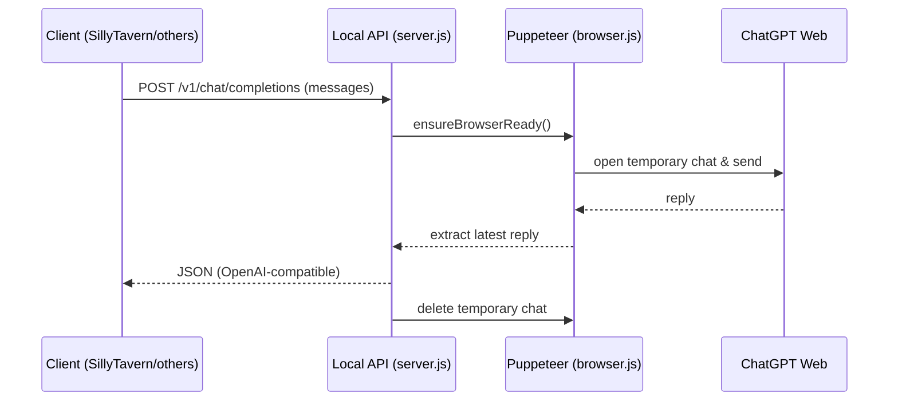

# ChatGPT Puppeteer Proxy
**English** | [中文](./README.md)

## Overview
This project wraps the **ChatGPT web UI** with **Puppeteer** and exposes a local API that is **OpenAI Chat Completions–compatible**. It enables tools like **SillyTavern** to talk to ChatGPT via your logged-in web session, with support for **temporary chats** to keep your main context clean and totally use your context instead of that of OpenAI.

> **Note 1:** The web UI is largely unified under **ChatGPT 5 series** now; this project doesn’t implement client-side model selection—whatever the web uses is what you’ll get.  
> **Note 2:** Headless mode can be flaky; we default to **headed** for observability and stability.

---

## Project Structure

### `browser.js`
Controls Chromium via Puppeteer.

Key features:
- **Init & keepalive**: `initBrowser` / `ensureBrowserReady`  
- **Send & capture replies**: `sendMessage` / `sendTemperaryMessage`  
- **Robust actions with retries**: `clickElement` / `retryUntilSuccess`  
- **Conversation ops**: enter project chat, create/delete temporary chat, bulk deletion  
- **Completion detection**: speech button state + text stability (`waitForResponseComplete`)  
- **Unified error type**: `ApiError` for consistent API-layer errors

### `server.js`
Express server exposing an OpenAI-like endpoint: `/v1/chat/completions`.

Key features:
- Validation + OpenAI-style error responses  
- Upstream timeout (default 90s)  
- Temp chat Q&A with auto clean-up afterward  
- `/status` health check, `/v1/models` placeholder  
- Graceful browser shutdown

---

## Usage

### 1) Install dependencies

#### 1.1 Node.js
Requires **Node.js 18+**.  
Install from [nodejs.org](https://nodejs.org/) or via `nvm`:
```bash
nvm install 18
nvm use 18
```

#### 1.2 Project deps
```bash
npm install
```
> **Tip:** Puppeteer downloads Chromium by default. If you already have Chrome/Chromium and want to save space:
```bash
PUPPETEER_SKIP_DOWNLOAD=true npm install
```
Then point to your local Chrome binary in `browser.js`.

### 2) Get `cookies.json`
Reuse your logged-in ChatGPT session:
1. Log into [https://chatgpt.com/](https://chatgpt.com/) in Chrome.  
2. Install **Get cookies.txt LOCALLY** extension.  
3. Export site cookies (txt or JSON).  
4. Save as `cookies.json` in the project root.

### 3) Start the server
```bash
node server.js
```
Default base URL: `http://localhost:3000`

### 4) API example
```bash
curl -X POST http://localhost:3000/v1/chat/completions   -H "Content-Type: application/json"   -d '{
    "messages": [
      { "role": "user", "content": "Hello" }
    ]
  }'
```

---

## SillyTavern Integration (Step-by-Step)

1. Start the local proxy: `node server.js` (port `3000`).  
2. Open SillyTavern → **API Connections**.  
3. Configure:  
   - **API**: `ChatCompletion`  
   - **Chat Completion Source**: `Custom (OpenAI-compatible)`  
   - **Custom Endpoint (Base URL)**: `http://localhost:3000/v1`  
   - **Custom API Key**: any placeholder (e.g., `local-proxy`)  
   - **Enter a Model ID**: you may put `gpt-4o` (the web’s default model will be used anyway)

Reference screenshot:  


4. Click **Save** → **Test Message**; if you get a reply, you’re good to go.

---

## Sequence Diagram


---

## Use Cases
- **SillyTavern bridge** with temporary or persistent conversations  
- **RP & context isolation** via ephemeral chat  
- **Personal gateway** that leverages the web UI instead of official API
