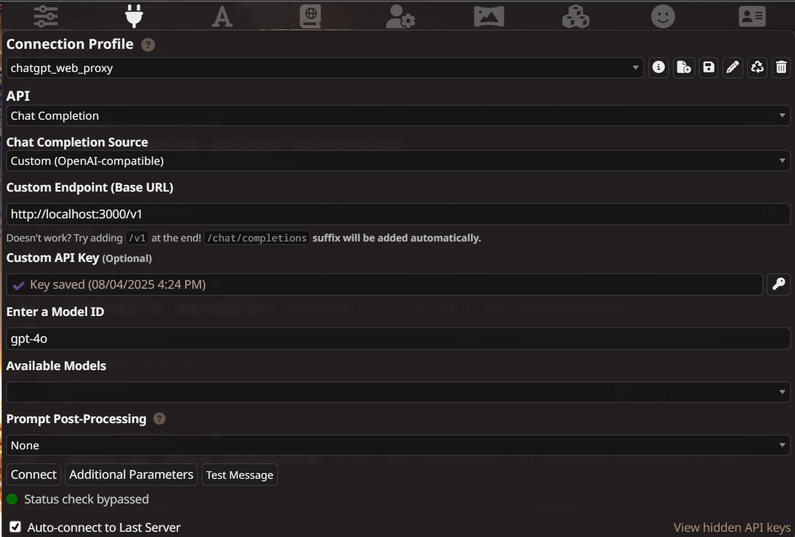
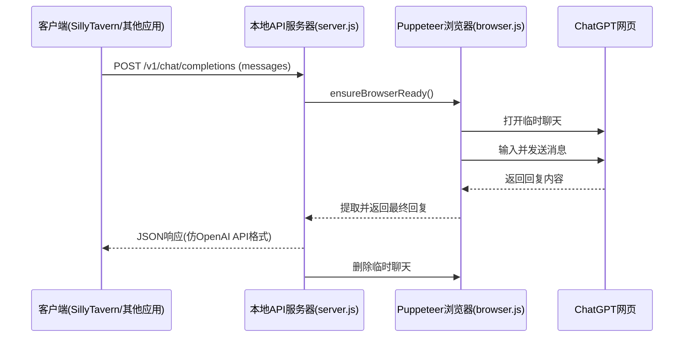

# ChatGPT Puppeteer Proxy
[English](./README.en.md) | **中文**
## 项目简介
本项目是一个基于 **Puppeteer** 的本地 ChatGPT 网页代理，核心目标是将个人 ChatGPT Plus 账号的网页对话功能封装为类 OpenAI API 接口，以便对接 **SillyTavern** 等外部应用，实现更灵活的角色扮演（RP）会话管理。同时使用的是临时对话管理保证了网页端的正常使用和纯净。
简单来说，此项目可以把chatgpt网页当OpenAI Chat Completions API使用。
> **说明1**：目前 ChatGPT 官方网页端已统一到 **ChatGPT 5 系列**，本项目暂未加入自定义模型选择功能，默认使用当前网页提供的模型。
> **说明2**：无头模式存在一定问题但也能用，所以本地使用的是有头模式。
---

## 项目结构

### `browser.js`
负责浏览器自动化逻辑，通过 Puppeteer 启动并控制 Chromium。

主要功能：
- **浏览器初始化与保活**  
  `initBrowser` / `ensureBrowserReady`
- **消息发送与回复抓取**  
  `sendMessage` / `sendTemperaryMessage`
- **页面元素点击与重试机制**  
  `clickElement` / `retryUntilSuccess`
- **会话管理**  
  - 进入项目对话  
  - 新建/删除临时聊天  
  - 批量删除历史会话
- **回复等待机制**  
  通过检测 UI 状态与文本稳定性来判断回复完成
- **通用错误类型**  
  提供 `ApiError` 用于统一 API 层错误处理

---

### `server.js`
基于 **Express** 提供 HTTP 接口，将 Puppeteer 操作封装成类似 OpenAI API 的 `/v1/chat/completions` 端点。

主要功能：
- 请求校验与错误格式化（保持与 OpenAI API 相似的错误结构）
- 上游调用超时控制（默认 90 秒）
- 临时聊天模式下调用 Puppeteer 完成一次问答，并在会话结束后删除临时聊天
- `/status` 健康检查接口
- `/v1/models` 模型列表占位（暂仅返回 `gpt-4o` 作为占位）
- 进程退出时平滑关闭浏览器实例

---

## 核心特点
1. **伪 API 实现**  
   模拟 OpenAI Chat Completions API 格式，方便对接现有前端/客户端，输出结构与官方 API 保持一致，包括 `id`、`choices`、`model` 等字段。

2. **临时聊天支持**  
   - 通过网页按钮控制开启/关闭临时聊天，避免污染主对话上下文。  
   - 对话结束后自动删除临时会话，保持环境整洁。

3. **稳定性优化**  
   - 对多处可能失败的网页操作（选择器等待、输入、点击等）加入 **多次重试机制**。  
   - 回复抓取时清理无关 UI 元素，并将代码块格式化，减少噪声。

4. **可扩展性**  
   - 抽象出通用浏览器操作方法，便于扩展更多自动化功能（如固定项目聊天、批量管理会话等）。

---

## 使用指南

### 1. 安装依赖

#### 1.1 安装 Node.js 环境
本项目需要 Node.js 18+ 环境。  
- [Node.js 官方下载](https://nodejs.org/)  
- 或使用 `nvm` 安装：
```bash
# 安装并使用 Node.js 18 LTS
nvm install 18
nvm use 18
```

#### 1.2 安装项目依赖
```bash
npm install
```

> **注意**：`puppeteer` 默认会下载 Chromium，如果你已安装 Chrome/Chromium 并希望节省空间，可以设置：
```bash
PUPPETEER_SKIP_DOWNLOAD=true npm install
```
并在 `browser.js` 中指定本地 Chrome 路径。

### 2. 获取 `cookies.json`
本项目需要使用已登录 ChatGPT 网页的 Cookies 来保持会话，建议通过 **Chrome 插件** 获取：
1. 打开 Chrome 浏览器并登录 [ChatGPT 网页](https://chatgpt.com/)。
2. 安装 [Get cookies.txt LOCALLY](https://chrome.google.com/webstore/detail/get-cookiestxt-locally/cclelndahbckbenkjhflpdbgdldlbecc) 插件。
3. 登录后，点击插件图标，导出当前站点 cookies 为 **`cookies.txt`**。
4. 将 `cookies.txt` 转换为 JSON（插件通常会直接提供 JSON 格式），重命名为 `cookies.json`，放到项目根目录。

### 3. 启动服务
```bash
node server.js
```
默认会监听 `http://localhost:3000`。

### 4. API 调用示例
```bash
curl -X POST http://localhost:3000/v1/chat/completions -H "Content-Type: application/json" -d '{
  "messages": [
    { "role": "user", "content": "你好" }
  ]
}'
```

---
### 2. 获取 `cookies.json`
本项目需要使用已登录 ChatGPT 网页的 Cookies 来保持会话，建议通过 **Chrome 插件** 获取：
1. 打开 Chrome 浏览器并登录 [ChatGPT 网页](https://chatgpt.com/)。
2. 安装 [Get cookies.txt LOCALLY](https://chrome.google.com/webstore/detail/get-cookiestxt-locally/cclelndahbckbenkjhflpdbgdldlbecc) 插件。
3. 登录后，点击插件图标，导出当前站点 cookies 为 **`cookies.txt`**。
4. 将 `cookies.txt` 转换为 JSON（插件通常会直接提供 JSON 格式），重命名为 `cookies.json`，放到项目根目录。

### 3. 启动服务
```bash
node server.js
```
默认会监听 `http://localhost:3000`。

### 4. API 调用示例
```bash
curl -X POST http://localhost:3000/v1/chat/completions -H "Content-Type: application/json" -d '{
  "messages": [
    { "role": "user", "content": "你好" }
  ]
}'
```

---

## SillyTavern 接入傻瓜式指南

本项目的 API 格式与 OpenAI Chat Completions 兼容，所以可以直接在 SillyTavern 中添加为一个新的自定义 API 连接。

### 步骤 1：启动本地代理
先确保你已经按照上文 **使用指南** 启动了服务，例如：
```bash
node server.js
```
默认会在本地 `http://localhost:3000` 运行。

### 步骤 2：打开 SillyTavern 设置
1. 启动 SillyTavern 客户端。
2. 进入 置顶的**API Connections** 选项卡。(第二个的插头按钮)
### 步骤 3：添加自定义 API
1. **API** 选择：
   ```
   ChatCompletion
   ```
2. **Chat Completion Source** 选择：
   ```
   Custom (OpenAI-compatible)
   ```
3. **Custom Endpoint (Base URL)** 填入：
   ```
   http://localhost:3000/v1
   ```
4. **Custom API Key** 可随便填写一个占位符（如 `local-proxy`）。
5. **Enter a Model ID** 随意填（新版本后好像只有gpt5了，所以没有研究）：
   ```
   gpt5或者不填
   ```
   （实际会使用网页当前的默认模型）

**参考配置截图**：  


### 步骤 4：保存并测试
1. 点击 **Save（保存）**。
2. 点击 **Test Message** 测试连接。
3. 返回主界面与角色对话，如能正常回复即说明接入成功。

---

### 常见问题
1. **SillyTavern 显示 API 错误？**
   - 检查 `server.js` 是否运行。
   - 检查 `cookies.json` 是否有效（Cookies 过期需重新获取）。
2. **回复延迟很高？**
   - 因 Puppeteer 模拟网页操作，速度取决于网络质量和 ChatGPT 网页响应速度，通常比官方 API 慢。
3. **能否多会话并发？**
   - 当前版本是单浏览器单页面模式，不支持高并发。如需可考虑多实例运行或多页面管理。

---

## 执行流程图



---

## 适用场景
- **SillyTavern 接入**：作为中间层，将网页 ChatGPT 转换为 API 接口，支持长期或临时对话管理。
- **角色扮演与上下文控制**：利用临时聊天避免污染主要上下文。
- **个人 API 网关**：在不直接调用 OpenAI API 的前提下，通过网页端间接调用 GPT 模型。
